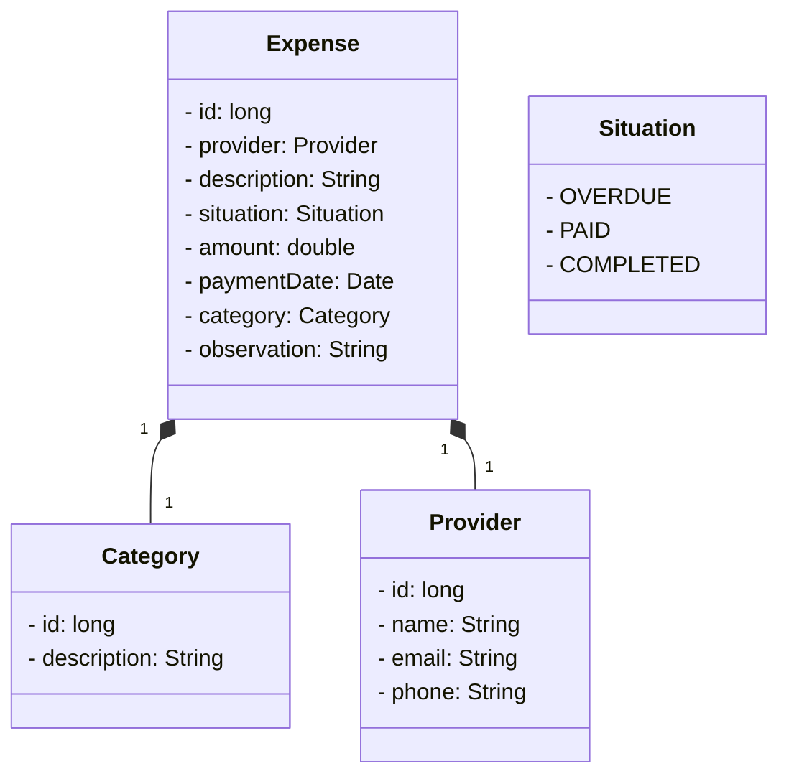

## Diagrama de Classes

```mermaid
classDiagram
  class Expense {
    - id: long
    - provider: Provider
    - description: String
    - situation: Situation
    - amount: double
    - paymentDate: Date
    - category: Category
    - observation: String
  }
  class Provider {
    - id: long
    - name: String
    - email: String
    - phone: String
  }
  class Category {
    - id: long
    - description: String
  }
  class Situation {
    - OVERDUE
    - PAID
    - COMPLETED
  }

  Expense "1" *-- "1" Category
  Expense "1" *-- "1" Provider
```
